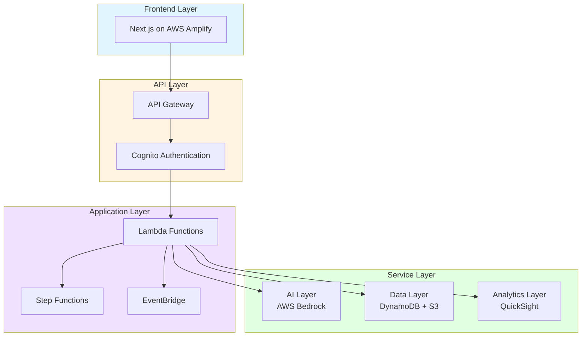
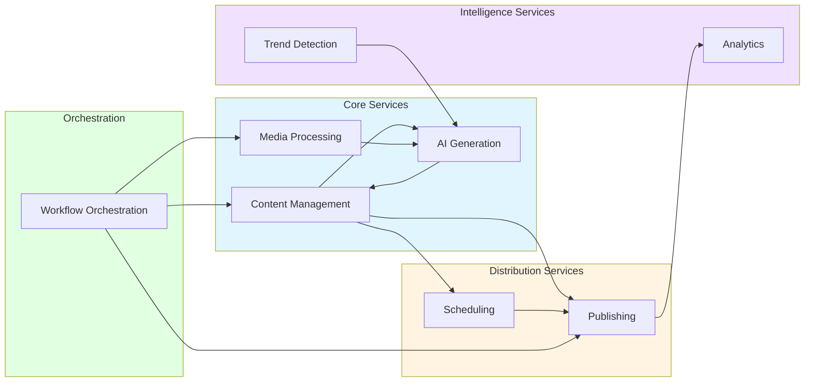
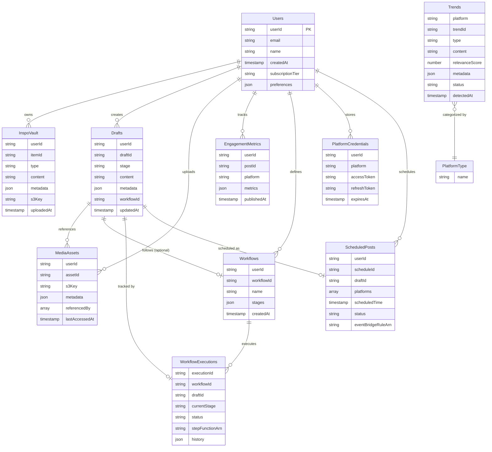

# Design Document: CreatorOps - AI Content Assistant

## Overview

CreatorOps is a serverless AI-powered content creation platform built on AWS that transforms the content creation workflow from inspiration to publication. The system enables creators to upload raw content, receive AI-generated ideas and technical outputs, manage content through staging pipelines, and publish to multiple social platforms with platform-specific optimizations.

### Core Workflows

1. **Upload-to-Post Pipeline**: Raw video upload → AI processing → technical outputs (SRT, silence markers) → ready-to-post video
2. **Idea Generation Pipeline**: Inspiration library → AI-generated hooks and scripts → refined content → draft creation
3. **Multi-Platform Publishing**: Draft content → platform-specific adaptation → scheduled/immediate publishing → analytics feedback

### Design Principles

- **Serverless-First**: Leverage AWS Lambda and managed services for scalability and cost efficiency
- **Event-Driven Architecture**: Use EventBridge and Step Functions for workflow orchestration
- **AI-Augmented**: Integrate AWS Bedrock throughout the pipeline for content generation and analysis
- **Platform-Agnostic Storage**: Separate content storage from platform-specific formatting
- **Graceful Degradation**: Provide fallback options when AI services are unavailable

## Architecture

### High-Level Architecture

The system follows a layered architecture with clear separation of concerns:

### Component Architecture

The system is organized into eight major services that work together to provide end-to-end content creation capabilities:

**Service Responsibilities:**

1. **Content Management Service**: Handles inspiration library (InspoVault), draft management, content staging, and repurposing
2. **Media Processing Service**: Processes raw videos, generates technical outputs (SRT, silence markers, edit suggestions)
3. **AI Generation Service**: Generates content ideas, hooks, scripts, and platform-specific adaptations using AWS Bedrock
4. **Publishing Service**: Multi-platform publishing with platform-specific formatting and OAuth credential management
5. **Scheduling Service**: Smart scheduling based on engagement analytics and optimal posting time recommendations
6. **Analytics Service**: Aggregates metrics from all platforms and generates AI-driven performance insights
7. **Trend Detection Service**: Monitors and analyzes viral topics, trending hashtags, and content formats
8. **Workflow Orchestration Service**: Manages approval pipelines, automated workflows, and multi-stage content processing

## Components and Interfaces

### Service Overview

| Service | Primary Responsibilities | AWS Services |
|---------|-------------------------|--------------|
| Content Management | Manage InspoVault, draft lifecycle, content staging, repurposing | DynamoDB, S3, Lambda |
| Media Processing | Upload videos, generate SRT/silence markers/edit suggestions, Adobe exports | S3, Step Functions, Lambda, Bedrock |
| AI Generation | Generate ideas/hooks/scripts, platform-specific adaptations, trend integration | Bedrock, Lambda, DynamoDB |
| Publishing | Multi-platform publishing, OAuth credential management, API integrations | Lambda, Secrets Manager, DynamoDB |
| Scheduling | Analyze engagement patterns, recommend posting times, schedule automation | EventBridge Scheduler, DynamoDB, Lambda |
| Analytics | Aggregate metrics, generate AI insights, identify top-performing content | QuickSight, DynamoDB, Lambda, Bedrock |
| Trend Detection | Monitor viral topics/hashtags, score trends, integrate into generation | Lambda, DynamoDB, EventBridge, Bedrock |
| Workflow Orchestration | Define workflows, manage approval gates, handle failures | Step Functions, SNS, DynamoDB, Lambda |

### Platform-Specific Adaptations

| Platform | Tone | Character Limit | Hashtag Strategy |
|----------|------|-----------------|------------------|
| Instagram | Casual, visual-focused | 2,200 | 10-15 relevant hashtags |
| LinkedIn | Professional, industry-focused | 3,000 | 3-5 professional hashtags |
| X (Twitter) | Concise, trending | 280 | 2-3 trending hashtags |
| YouTube Shorts | Hook-driven, engaging | 5,000 | 5-10 discovery hashtags |

### API Interfaces

The system exposes RESTful APIs for each service with standard CRUD operations and service-specific methods. All APIs follow consistent patterns for authentication (Cognito tokens), error handling (standardized error codes), and response formats (JSON).

**Key API Services:**
- Content Management API: InspoVault and draft operations
- Media Processing API: Video upload, processing status, technical output generation
- AI Generation API: Content generation, refinement, platform adaptation
- Publishing API: Multi-platform publishing, credential management
- Scheduling API: Schedule management, posting time recommendations
- Analytics API: Dashboard data, AI insights, engagement tracking
- Trend Detection API: Trend retrieval, relevance scoring
- Workflow Orchestration API: Workflow definition, execution, approval management

## Data Models

## Error Handling

### Error Response Format

All API errors follow a consistent JSON structure:
- `code`: Machine-readable error code
- `message`: Human-readable error message
- `details`: Additional context (field names, timestamps, request IDs)
- `retryable`: Boolean indicating if operation can be retried
- `suggestedAction`: Guidance for resolution

### Error Categories and Handling

| Category | HTTP Code | Handling Strategy | Retry Policy |
|----------|-----------|-------------------|--------------|
| Validation Errors | 400 | Fail fast, return validation errors | No retry |
| Authorization Errors | 403 | Deny operation, log security event | No retry |
| Resource Not Found | 404 | Return 404, suggest alternatives | No retry |
| External Service Failures | 5xx | Retry with exponential backoff, use fallbacks | 3 retries |
| Timeout Errors | 504 | Log context, notify user, suggest optimization | No retry |
| Data Integrity Errors | 500 | Reject operation, quarantine data, alert admins | No retry |

### Service-Specific Error Codes

| Service | Error Code | Description |
|---------|------------|-------------|
| **Content Management** | `INVALID_FORMAT` | Unsupported file format |
| | `MISSING_FIELDS` | Required fields missing |
| | `UNAUTHORIZED` | Permission denied |
| | `DRAFT_NOT_FOUND` | Draft does not exist |
| | `INVALID_TRANSITION` | Invalid stage transition |
| | `QUOTA_EXCEEDED` | Storage quota exceeded |
| | `DATABASE_ERROR` | DynamoDB operation failed |
| **Media Processing** | `UNSUPPORTED_VIDEO` | Video format not supported |
| | `QUALITY_CHECK_FAILED` | Video quality below threshold |
| | `TRANSCRIPTION_UNAVAILABLE` | Transcription service unavailable |
| | `LOW_CONFIDENCE_AUDIO` | Audio unclear, cannot generate accurate output |
| | `WORKFLOW_TIMEOUT` | Processing workflow timed out |
| | `STORAGE_FAILURE` | Failed to store file |
| | `EXPORT_FAILED` | Adobe export failed |
| **AI Generation** | `AI_SERVICE_UNAVAILABLE` | AI service temporarily unavailable |
| | `INVALID_REQUEST` | Missing required parameters |
| | `CONTEXT_TOO_LARGE` | InspoVault context exceeds maximum size |
| | `RATE_LIMIT_EXCEEDED` | AI generation rate limit exceeded |
| | `GENERATION_TIMEOUT` | AI generation timed out |
| | `INVALID_PLATFORM` | Platform not supported |
| **Publishing** | `MISSING_CREDENTIALS` | Platform credentials not found |
| | `INVALID_TOKEN` | OAuth token invalid or expired |
| | `PLATFORM_API_ERROR` | Platform API error |
| | `CONTENT_TOO_LONG` | Content exceeds platform limit |
| | `PARTIAL_FAILURE` | Published to some platforms, failed on others |
| | `NETWORK_TIMEOUT` | Connection to platform timed out |
| | `MEDIA_UPLOAD_FAILED` | Failed to upload media to platform |
| **Scheduling** | `INVALID_TIME` | Scheduled time must be in future |
| | `SCHEDULE_CONFLICT` | Conflict with existing schedule |
| | `SCHEDULER_ERROR` | Failed to create schedule |
| | `INSUFFICIENT_DATA` | Not enough historical data for recommendations |
| | `INVALID_DATE_RANGE` | Invalid date range specified |
| | `SCHEDULE_NOT_FOUND` | Scheduled post not found |
| **Analytics** | `ANALYTICS_API_UNAVAILABLE` | Platform analytics API unavailable |
| | `INVALID_DATE_RANGE` | Date range invalid |
| | `INSUFFICIENT_DATA` | Not enough data to generate insights |
| | `DASHBOARD_ERROR` | Failed to load dashboard |
| | `AGGREGATION_TIMEOUT` | Metrics aggregation timed out |
| **Trend Detection** | `TREND_API_FAILURE` | Failed to fetch trends from source |
| | `INVALID_TREND_DATA` | Trend data validation failed |
| | `TREND_NOT_FOUND` | Trend not found or archived |
| | `SCORING_FAILED` | Failed to calculate relevance scores |
| | `DATABASE_ERROR` | Failed to store trend data |
| **Workflow Orchestration** | `INVALID_WORKFLOW_CONFIG` | Workflow configuration invalid |
| | `MISSING_APPROVERS` | Required approvers not specified |
| | `STAGE_FAILED` | Workflow stage failed |
| | `EXECUTION_ERROR` | Workflow execution failed |
| | `APPROVAL_TIMEOUT` | Approval not received within timeout |
| | `CIRCULAR_DEPENDENCY` | Workflow contains circular dependencies |
| | `WORKFLOW_NOT_FOUND` | Workflow not found |
| | `NOTIFICATION_FAILED` | Failed to notify approvers |
| **Cross-Service** | `DATA_CORRUPTION` | Data integrity check failed |
| | `LAMBDA_TIMEOUT` | Function timed out |
| | `SECRETS_ERROR` | Failed to retrieve credentials |
| | `S3_ACCESS_DENIED` | Access denied to S3 resource |
| | `INTERNAL_ERROR` | Unexpected error occurred |

## Testing Strategy

### Dual Testing Approach

The system requires both unit tests and property-based tests for comprehensive coverage.

**Unit Tests:**
- Verify specific examples and edge cases
- Test integration points between components
- Validate error conditions and boundary cases

**Property-Based Tests:**
- Verify universal properties across all inputs
- Test correctness properties defined in this document
- Use randomized input generation for comprehensive coverage
- Minimum 100 iterations per property test

## Correctness Properties

A property is a characteristic or behavior that should hold true across all valid executions of a system—essentially, a formal statement about what the system should do. Properties serve as the bridge between human-readable specifications and machine-verifiable correctness guarantees.

<table>
  <colgroup>
    <col style="width:30%">
    <col style="width:70%">
  </colgroup>
  <thead>
    <tr>
      <th>Requirement</th>
      <th>Properties</th>
    </tr>
  </thead>
  <tbody>
    <tr>
      <td><strong>Requirement 1: Inspiration Management</strong></td>
      <td>

<strong>Property 1.1: Content Storage with Metadata</strong>

*For any* valid content upload (post, hook, visual, audio, or trend), storing it in InspoVault should result in the content being retrievable with all required metadata fields (id, userId, type, content, uploadedAt, tags).

**Validates: Requirements 1.1**

<strong>Property 1.2: Content Organization by Type</strong>

*For any* set of InspoVault items, retrieving them should return items grouped by type with consistent categorization.

**Validates: Requirements 1.2**

<strong>Property 1.3: AI Context Integration</strong>

*For any* AI generation request with specified InspoVault item IDs, the generated content should incorporate or reference the provided context items.

**Validates: Requirements 1.3**

<strong>Property 1.4: Sorted Retrieval</strong>

*For any* view request for InspoVault items, the returned items should be organized by type and sorted by date in descending order.

**Validates: Requirements 1.4**

<strong>Property 1.5: Deletion Completeness</strong>

*For any* InspoVault item, after deletion, the item should not appear in storage queries and should not be included in subsequent AI generation context.

**Validates: Requirements 1.5**

<strong>Property 1.6: Format Validation</strong>

*For any* file upload with an invalid or unsupported format, the system should reject the upload and return a descriptive error message.

**Validates: Requirements 1.6**

<strong>Property 1.7: Authorization Enforcement</strong>

*For any* operation on InspoVault items, if the requesting user does not own the item, the operation should be denied.

**Validates: Requirements 1.8**

      </td>
    </tr>
    <tr>
      <td><strong>Requirement 2: Raw Content Upload and Processing</strong></td>
      <td>

<strong>Property 2.1: Quality Preservation</strong>

*For any* valid video upload, the stored video in S3 should maintain the same resolution, codec, and quality metrics as the original file.

**Validates: Requirements 2.1**

<strong>Property 2.2: Workflow Initiation</strong>

*For any* video successfully stored in S3, a Step Functions workflow execution should be initiated and the video's processingStatus should be set to "processing".

**Validates: Requirements 2.2**

<strong>Property 2.3: Workflow Completion</strong>

*For any* completed Step Functions workflow, a ready-to-post video file should exist in the processed-videos S3 location and the processingStatus should be "completed".

**Validates: Requirements 2.3**

<strong>Property 2.4: Adobe Format Compatibility</strong>

*For any* export request, the generated file should be in a format compatible with Adobe software (ProRes, DNxHD, or H.264 with appropriate settings).

**Validates: Requirements 2.4**

<strong>Property 2.5: Status Accuracy</strong>

*For any* video processing workflow, querying the status should return the current stage that matches the actual Step Functions execution state.

**Validates: Requirements 2.5**

<strong>Property 2.6: Unsupported Format Rejection</strong>

*For any* video upload with an unsupported format, the system should reject the upload before storing to S3 and notify the user with the list of supported formats.

**Validates: Requirements 2.6**

      </td>
    </tr>
    <tr>
      <td><strong>Requirement 3: Content Idea Generation</strong></td>
      <td>

<strong>Property 3.1: Context-Based Generation</strong>

*For any* idea generation request with InspoVault context, the system should generate suggestions that reference or are influenced by the provided context items.

**Validates: Requirements 3.1**

<strong>Property 3.2: Complete Output Structure</strong>

*For any* generated idea, the output should contain all required components: hooks, scripts, and edit suggestions.

**Validates: Requirements 3.2**

<strong>Property 3.3: Refinement Capability</strong>

*For any* selected idea, the system should allow modifications to scripts and edits, and the refined version should be stored as a new draft.

**Validates: Requirements 3.3**

<strong>Property 3.4: Historical Personalization</strong>

*For any* user with historical content data, generated ideas should reflect patterns from the user's past content style and topics.

**Validates: Requirements 3.4**

<strong>Property 3.5: Request Validation</strong>

*For any* idea generation request with invalid parameters (missing required fields, invalid types), the system should return a descriptive error without attempting generation.

**Validates: Requirements 3.6**

      </td>
    </tr>
    <tr>
      <td><strong>Requirement 4: Technical Content Output Generation</strong></td>
      <td>

<strong>Property 4.1: SRT Format Correctness</strong>

*For any* SRT generation request, the output file should conform to the SRT format specification with sequential indices, valid timestamps (HH:MM:SS,mmm), and non-empty text for each subtitle entry.

**Validates: Requirements 4.1**

<strong>Property 4.2: Silence Detection Accuracy</strong>

*For any* silence detection request, identified silent segments should have start and end timestamps within the video duration and include confidence scores.

**Validates: Requirements 4.2**

<strong>Property 4.3: Edit Suggestion Format</strong>

*For any* edit suggestion request, recommendations should include valid timecodes within the video duration and be formatted for Adobe compatibility.

**Validates: Requirements 4.3**

<strong>Property 4.4: Output Persistence</strong>

*For any* successfully generated technical output (SRT, silence markers, edit suggestions), the file should be stored in S3 and a downloadable signed URL should be available.

**Validates: Requirements 4.4**

<strong>Property 4.5: Specification Matching</strong>

*For any* generated technical output, the file specifications (format, encoding, frame rate) should match the original source video specifications.

**Validates: Requirements 4.5**

<strong>Property 4.6: Low Confidence Handling</strong>

*For any* audio processing with unclear audio (low confidence scores below threshold), the system should return an error with confidence scores rather than generating potentially incorrect output.

**Validates: Requirements 4.6**

<strong>Property 4.7: Media Format Validation</strong>

*For any* technical output generation request with unsupported media format, the system should reject the request and notify the user with supported formats.

**Validates: Requirements 4.7**

<strong>Property 4.8: Error Detail Reporting</strong>

*For any* processing failure during technical output generation, the system should return an error with specific details about the failure stage and reason.

**Validates: Requirements 4.8**

      </td>
    </tr>
    <tr>
      <td><strong>Requirement 5: Draft Management and Staging</strong></td>
      <td>

<strong>Property 5.1: Initial Stage Assignment</strong>

*For any* newly created content draft, the stage should be initialized to "Saved".

**Validates: Requirements 5.1**

<strong>Property 5.2: Valid Stage Transitions</strong>

*For any* stage transition request with a valid target stage (Saved → Draft → Scheduled → Published), the draft's stage should be updated to the new stage.

**Validates: Requirements 5.2**

<strong>Property 5.3: Stage-Independent Generation</strong>

*For any* draft at any stage (Saved, Draft, Scheduled, Published), generation requests for subtitles, captions, or scripts should be allowed and produce valid outputs.

**Validates: Requirements 5.3**

<strong>Property 5.4: Repurposing with References</strong>

*For any* repurpose request, a new draft should be created with the stage set to "Saved" and the inspoReferences field should include the original draft's ID.

**Validates: Requirements 5.4**

<strong>Property 5.5: Complete Deletion</strong>

*For any* draft deletion request, the draft should be removed from the Drafts table and all associated media assets should be marked for archival in S3.

**Validates: Requirements 5.5**

<strong>Property 5.6: Invalid Transition Rejection</strong>

*For any* stage transition request with an invalid target stage (e.g., Published → Saved), the system should reject the transition and notify the user.

**Validates: Requirements 5.6**

<strong>Property 5.7: Required Field Validation</strong>

*For any* stage transition that requires specific fields (e.g., Scheduled requires scheduledTime), the system should block the transition if required fields are missing.

**Validates: Requirements 5.7**

<strong>Property 5.8: Modification Authorization</strong>

*For any* draft modification request, if the requesting user does not own the draft, the operation should be denied.

**Validates: Requirements 5.8**

      </td>
    </tr>
    <tr>
      <td><strong>Requirement 6: Platform-Specific Content Adaptation</strong></td>
      <td>

<strong>Property 6.1: Tone Adaptation</strong>

*For any* platform selection, the adapted content should reflect the platform's tone conventions (casual for Instagram, professional for LinkedIn, concise for X).

**Validates: Requirements 6.1**

<strong>Property 6.2: Instagram Formatting</strong>

*For any* content adapted for Instagram, the output should include 10-15 relevant hashtags and visual-focused language.

**Validates: Requirements 6.2**

<strong>Property 6.3: LinkedIn Formatting</strong>

*For any* content adapted for LinkedIn, the output should use professional tone and include 3-5 industry-relevant hashtags.

**Validates: Requirements 6.3**

<strong>Property 6.4: X Character Limit</strong>

*For any* content adapted for X (Twitter), the output should not exceed 280 characters and should include 2-3 trending hashtags.

**Validates: Requirements 6.4**

<strong>Property 6.5: YouTube Shorts Formatting</strong>

*For any* content adapted for YouTube Shorts, the output should include hook-driven descriptions with timestamps and 5-10 discovery hashtags.

**Validates: Requirements 6.5**

<strong>Property 6.6: Platform Validation</strong>

*For any* adaptation request with an unsupported platform, the system should return an error listing supported platforms.

**Validates: Requirements 6.6**

<strong>Property 6.7: Length Constraint Enforcement</strong>

*For any* content that exceeds platform-specific limits after adaptation, the system should request content reduction and provide the current and maximum character counts.

**Validates: Requirements 6.7**

      </td>
    </tr>
    <tr>
      <td><strong>Requirement 7: Automated Workflow Pipelines</strong></td>
      <td>

<strong>Property 7.1: Workflow Configuration Storage</strong>

*For any* workflow creation request, the workflow configuration should be stored with all approval stages, rules, and stage ordering preserved.

**Validates: Requirements 7.1**

<strong>Property 7.2: Sequential Stage Execution</strong>

*For any* draft entering a workflow, the stages should execute in the order defined in the workflow configuration via Step Functions.

**Validates: Requirements 7.2**

<strong>Property 7.3: Approval Gate Behavior</strong>

*For any* workflow reaching an approval stage, the execution should pause, approvers should be notified via SNS, and the workflow status should be "waiting_approval".

**Validates: Requirements 7.3**

<strong>Property 7.4: Workflow Resumption</strong>

*For any* approval received for a paused workflow, the execution should resume and proceed to the next stage in the configuration.

**Validates: Requirements 7.4**

<strong>Property 7.5: Completion State Transition</strong>

*For any* workflow that completes all stages successfully, the associated draft should transition to the stage specified in the workflow configuration.

**Validates: Requirements 7.5**

<strong>Property 7.6: Configuration Validation</strong>

*For any* workflow creation with invalid configuration (missing required fields, circular dependencies, invalid stage types), the system should reject the workflow and notify the user with specific validation errors.

**Validates: Requirements 7.6**

<strong>Property 7.7: Stage Failure Handling</strong>

*For any* workflow stage that fails during execution, the workflow should halt, the status should be set to "failed", and administrators should be notified with error details and execution context.

**Validates: Requirements 7.7**

<strong>Property 7.8: Approver Validation</strong>

*For any* workflow start request, if required approvers are missing or invalid, the system should block the workflow from starting and notify the user.

**Validates: Requirements 7.9**

      </td>
    </tr>
    <tr>
      <td><strong>Requirement 8: Multi-Platform Publishing</strong></td>
      <td>

<strong>Property 8.1: Platform-Specific Preparation</strong>

*For any* multi-platform publish request, the system should prepare platform-specific versions of the content for each target platform with appropriate formatting and adaptations.

**Validates: Requirements 8.1**

<strong>Property 8.2: Credential-Based Publishing</strong>

*For any* platform with valid credentials, the system should successfully post content via the platform's API and receive a platform post ID.

**Validates: Requirements 8.2**

<strong>Property 8.3: Status Update on Success</strong>

*For any* successful publish to at least one platform, the draft status should be updated to "Published" and the publishedAt timestamp should be set.

**Validates: Requirements 8.3**

<strong>Property 8.4: Partial Failure Resilience</strong>

*For any* multi-platform publish where one platform fails, the system should log the error, continue publishing to remaining platforms, and not halt the entire operation.

**Validates: Requirements 8.4**

<strong>Property 8.5: Complete Summary Reporting</strong>

*For any* multi-platform publish request (regardless of success or failure), the system should provide a summary report containing the status, platform post ID (if successful), or error details for each platform.

**Validates: Requirements 8.5**

<strong>Property 8.6: Credential Validation</strong>

*For any* publish request with missing or invalid platform credentials, the system should block the publish for that platform and notify the user before attempting API calls.

**Validates: Requirements 8.6**

      </td>
    </tr> be updated to "Published" and the publishedAt timestamp should be set.    </tr>
    <tr>
      <td><strong>Requirement 9: Smart Scheduling</strong></td>
      <td>

<strong>Property 9.1: Data-Driven Recommendations</strong>

*For any* recommendation request with sufficient historical engagement data, the recommendations should be based on analysis of day, time, and performance metrics from past posts.

**Validates: Requirements 9.1, 9.2**

<strong>Property 9.3: Scheduler Configuration</strong>

*For any* schedule request, an EventBridge Scheduler rule should be created with the specified time and the scheduledPost record should store the rule ARN.

**Validates: Requirements 9.3**

<strong>Property 9.4: Automated Execution</strong>

*For any* scheduled post whose scheduled time has been reached, the publishing workflow should execute automatically via EventBridge trigger.

**Validates: Requirements 9.4**

<strong>Property 9.6: Past Time Rejection</strong>

*For any* schedule request with a time in the past, the system should reject the request and notify the user that the time must be in the future.

**Validates: Requirements 9.6**

<strong>Property 9.7: Conflict Detection</strong>

*For any* schedule request that conflicts with an existing schedule (same platform and time within 5 minutes), the system should reject the request and suggest alternative times.

**Validates: Requirements 9.7**

      </td>
    </tr>
    <tr>
      <td><strong>Requirement 10: Trend Detection and Analysis</strong></td>
      <td>

<strong>Property 10.1: Trend Identification</strong>

*For any* trend detection run, the system should identify and categorize viral topics, hashtags, and signals with appropriate type classification.

**Validates: Requirements 10.1**

<strong>Property 10.2: Trend Storage with Metadata</strong>

*For any* newly detected trend, the system should store it with a relevance score, timestamp, platform, and status set to "active".

**Validates: Requirements 10.2**

<strong>Property 10.3: Ranked Trend Retrieval</strong>

*For any* view trends request, the returned trends should be sorted by relevance score (descending) and then by recency for trends with equal scores.

**Validates: Requirements 10.3**

<strong>Property 10.4: Trend Integration in Generation</strong>

*For any* content generation request, if relevant trends exist for the target platform, the generated content should incorporate or reference those trends.

**Validates: Requirements 10.4**

<strong>Property 10.5: Trend Aging Mechanism</strong>

*For any* trend older than a defined threshold (e.g., 7 days), the relevance score should be reduced and trends below a minimum score should have status changed to "archived".

**Validates: Requirements 10.5**

<strong>Property 10.7: Invalid Trend Resilience</strong>

*For any* trend detection run that encounters invalid trend data, the system should skip the invalid entry, log the issue, and continue processing remaining trends.

**Validates: Requirements 10.7**

      </td>
    </tr>
    <tr>
      <td><strong>Requirement 11: Analytics and Growth Feedback</strong></td>
      <td>

<strong>Property 11.1: Multi-Platform Metrics Aggregation</strong>

*For any* dashboard view request, the displayed metrics should include engagement data from all connected platforms for the specified date range.

**Validates: Requirements 11.1**

<strong>Property 11.2: AI-Driven Insights Generation</strong>

*For any* performance analysis request with sufficient historical data, the system should generate AI suggestions based on patterns in the user's content performance.

**Validates: Requirements 11.2**

<strong>Property 11.3: Engagement Tracking</strong>

*For any* content published to a platform, the system should track and store engagement metrics (likes, comments, shares, views) associated with the post ID and platform.

**Validates: Requirements 11.3**

<strong>Property 11.4: Top Performer Identification</strong>

*For any* analytics request with sufficient data, the system should correctly identify top-performing content types and optimal posting times based on engagement metrics.

**Validates: Requirements 11.4**

<strong>Property 11.5: Dashboard Data Formatting</strong>

*For any* analytics visualization request, the data should be formatted correctly for QuickSight dashboards with proper dimensions and measures.

**Validates: Requirements 11.5**

<strong>Property 11.8: Date Range Validation</strong>

*For any* analytics request with an invalid date range (end before start, future dates), the system should reject the request and notify the user to provide a valid range.

**Validates: Requirements 11.8**

      </td>
    </tr>
    <tr>
      <td><strong>Requirement 12: User Authentication and Authorization</strong></td>
      <td>

<strong>Property 12.1: Authentication and Session Creation</strong>

*For any* login request with valid credentials, the system should authenticate the user and establish a secure session with a session token.

**Validates: Requirements 12.1**

<strong>Property 12.2: Permission Verification</strong>

*For any* resource access request, the system should verify the user's role and permissions before allowing the operation.

**Validates: Requirements 12.2**

<strong>Property 12.3: Valid Session Operations</strong>

*For any* operation request with a valid, non-expired session token, the system should allow the operation to proceed.

**Validates: Requirements 12.3**

<strong>Property 12.4: Encrypted Token Storage</strong>

*For any* platform connection via OAuth, the access and refresh tokens should be stored in Secrets Manager with encryption enabled.

**Validates: Requirements 12.4**

<strong>Property 12.5: Session Expiry Enforcement</strong>

*For any* operation request with an expired session token, the system should reject the request and require re-authentication.

**Validates: Requirements 12.5, 12.8**

<strong>Property 12.6: Invalid Credential Rejection</strong>

*For any* login request with invalid credentials, the system should deny access and notify the user without revealing whether the username or password was incorrect.

**Validates: Requirements 12.6**

<strong>Property 12.7: Brute Force Protection</strong>

*For any* user account with multiple consecutive failed login attempts (e.g., 5 within 15 minutes), the system should temporarily lock the account and notify the user.

**Validates: Requirements 12.7**

<strong>Property 12.9: Unauthorized Access Denial</strong>

*For any* resource access request where the user lacks required permissions, the system should deny the operation and return an authorization error.

**Validates: Requirements 12.9**

<strong>Property 12.10: OAuth Token Validation</strong>

*For any* platform connection attempt with invalid OAuth tokens, the system should reject the connection and prompt the user to re-authenticate with the platform.

**Validates: Requirements 12.10**

      </td>
    </tr>
    <tr>
      <td><strong>Requirement 13: Media Asset Management</strong></td>
      <td>

<strong>Property 13.1: Asset Storage with Metadata</strong>

*For any* media upload, the asset should be stored in S3 with metadata (filename, size, type, uploadedAt) and access controls set to private.

**Validates: Requirements 13.1**

<strong>Property 13.2: Reference Tracking</strong>

*For any* draft that references a media asset, the association should be maintained in the MediaAssets table's referencedBy field.

**Validates: Requirements 13.2**

<strong>Property 13.3: Signed URL Generation</strong>

*For any* asset access request, the system should generate a time-limited signed URL (e.g., 1 hour expiration) that allows temporary access to the asset.

**Validates: Requirements 13.3**

<strong>Property 13.4: Unreferenced Asset Archival</strong>

*For any* media asset with no references in the referencedBy field and lastAccessedAt older than 30 days, the asset should be marked for archival.

**Validates: Requirements 13.4**

<strong>Property 13.5: Storage Quota Monitoring</strong>

*For any* user whose total storage usage exceeds 90% of their quota, the system should notify the user and suggest assets for deletion.

**Validates: Requirements 13.5**

<strong>Property 13.6: Asset Format Validation</strong>

*For any* media upload with an invalid or unsupported file format, the system should reject the upload and notify the user with supported formats.

**Validates: Requirements 13.6**

<strong>Property 13.8: Expired URL Rejection</strong>

*For any* asset access attempt using an expired signed URL, the system should deny access and require generation of a new signed URL.

**Validates: Requirements 13.8**

<strong>Property 13.9: Asset Access Authorization</strong>

*For any* asset access request, if the requesting user does not own the asset, the system should deny access.

**Validates: Requirements 13.9**

      </td>
    </tr>
    <tr>
      <td><strong>Requirement 14: Content Repurposing</strong></td>
      <td>

<strong>Property 14.1: Draft Creation from Original</strong>

*For any* repurpose request, a new draft should be created with content derived from the original draft and the stage set to "Saved".

**Validates: Requirements 14.1**

<strong>Property 14.2: Platform-Specific Adaptation</strong>

*For any* repurpose request with a target platform specified, the new draft's content should be adapted for that platform's format, tone, and requirements.

**Validates: Requirements 14.2**

<strong>Property 14.3: Video Format Adaptation</strong>

*For any* video repurposing request, the system should provide suggestions for aspect ratio adjustments appropriate for the target platform (e.g., 9:16 for Instagram Stories, 16:9 for YouTube).

**Validates: Requirements 14.3**

<strong>Property 14.4: Text Length and Style Adaptation</strong>

*For any* text repurposing request, the adapted content should meet the target platform's length constraints and style conventions.

**Validates: Requirements 14.4**

<strong>Property 14.5: Repurposing Completion</strong>

*For any* completed repurposing operation, the system should return the adapted content in a reviewable format before creating the final draft.

**Validates: Requirements 14.5**

<strong>Property 14.6: Missing Content Handling</strong>

*For any* repurpose request referencing a non-existent original draft, the system should reject the request and notify the user that the content was not found.

**Validates: Requirements 14.6**

<strong>Property 14.7: Platform Support Validation</strong>

*For any* repurpose request with an unsupported target platform, the system should reject the request and notify the user with the list of supported platforms.

**Validates: Requirements 14.7**

<strong>Property 14.9: Adaptation Failure Notification</strong>

*For any* repurposing operation that cannot adapt the content (e.g., video too short for platform requirements), the system should notify the user with specific reasons why adaptation failed.

**Validates: Requirements 14.9**

      </td>
    </tr>
    <tr>
      <td><strong>Requirement 15: Error Handling and System Resilience</strong></td>
      <td>

<strong>Property 15.1: Exponential Backoff Retry</strong>

*For any* platform API failure, the system should retry the operation up to 3 times with exponential backoff delays (e.g., 1s, 2s, 4s) before marking as failed.

**Validates: Requirements 15.1**

<strong>Property 15.2: Timeout Error Logging</strong>

*For any* Lambda function timeout, the system should log the error with context (function name, input parameters, execution time) and notify the user with actionable information.

**Validates: Requirements 15.2**

<strong>Property 15.4: Database Failure Recovery</strong>

*For any* DynamoDB operation failure, the system should queue the operation for retry using SQS and maintain data consistency through idempotent operations.

**Validates: Requirements 15.4**

<strong>Property 15.5: Critical Error Alerting</strong>

*For any* critical error (system-wide failures, data corruption), the system should send alerts to administrators via SNS with full error context, stack traces, and affected resources.

**Validates: Requirements 15.5**

<strong>Property 15.6: Retry Exhaustion Handling</strong>

*For any* operation that exceeds maximum retry attempts, the system should mark the operation as failed, store the error details, and notify the user.

**Validates: Requirements 15.6**

<strong>Property 15.7: Unrecoverable Error Handling</strong>

*For any* unrecoverable error (invalid data format, missing required resources), the system should halt the operation immediately, notify the user with detailed error information, and not attempt retries.

**Validates: Requirements 15.7**

<strong>Property 15.8: Data Corruption Detection</strong>

*For any* operation that detects data corruption (checksum mismatch, invalid schema), the system should reject the operation, alert administrators, and quarantine the corrupted data.

**Validates: Requirements 15.8**

      </td>
    </tr>
  </tbody>
</table>